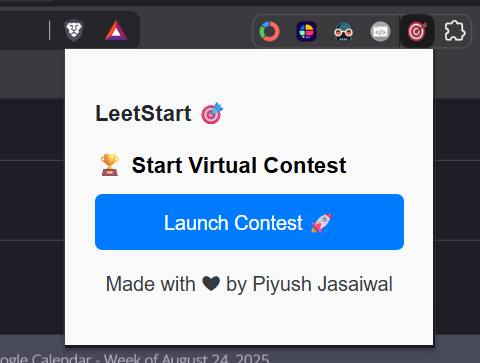

# 🚀 LeetStart

<p align="center">
  
</p>

**LeetStart** is a Chrome extension that instantly launches a past LeetCode Weekly or Biweekly contest for you. No scrolling. No searching. Just grinding.

Whether you're prepping for interviews or sharpening your problem-solving edge, LeetStart drops you straight into a virtual contest—randomly chosen from recent history.

---

## ✨ Features

- 🎯 One-click launch into a past Weekly or Biweekly contest  
- 🧠 Random selection from the past contests (excluding the latest)  
- 🔗 Directly opens the virtual contest start page  
- 🛡️ Fallback-safe: only launches contests that actually exist  
- 🧼 Minimal UI, maximum focus  

---

## 📦 Installation

1. Clone this repo:
   ```bash
   git clone https://github.com/piyushjasaiwal/LeetStart.git
   ```

2. Go to chrome://extensions  
3. Enable Developer Mode  
4. Click **Load unpacked**  
5. Select the **leetstart** folder  

---

## 🛠 Tech Stack

- Vanilla JS  
- DOM scraping from leetcode.com/contest  
- Chrome Extension APIs  

---

## 🧪 How It Works

- Fetches the latest Weekly and Biweekly contest slugs  
- Randomly chooses one type  
- Picks a contest number from the past (excluding the latest)  
- Opens the virtual contest page via template `https://leetcode.com/contest/{contest-name-and-number}/` URL  

---

## 🖼️ Demo

<p align="center">
  <a href="video/demo_compressed.mp4">
    
  </a>
</p>

---

## 👤 Author

**Piyush Jasaiwal**   

<a href="https://github.com/piyushjasaiwal">  </a> [github.com/piyushjasaiwal](https://github.com/piyushjasaiwal) 

<a href="https://www.linkedin.com/in/piyush-jasaiwal/">  </a> [linkedin.com/in/piyush-jasaiwal](https://www.linkedin.com/in/piyush-jasaiwal/) 

<a href="https://x.com/Piyush_Jasaiwal">  </a> [x.com/Piyush_Jasaiwal](https://x.com/Piyush_Jasaiwal)
